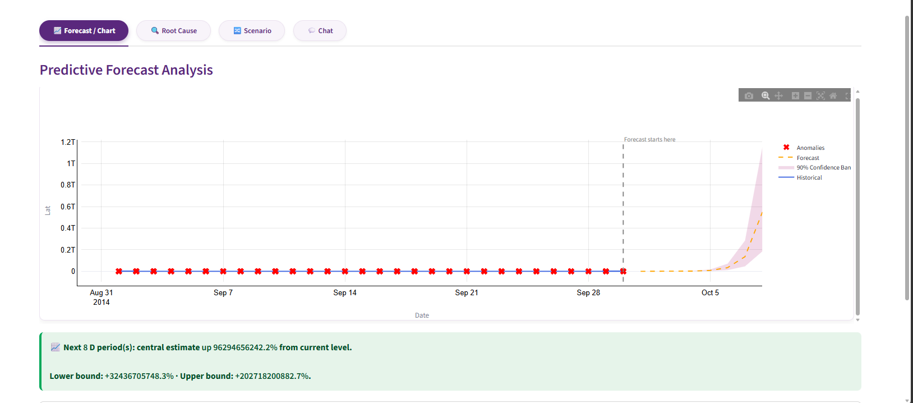
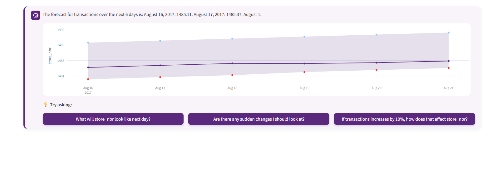
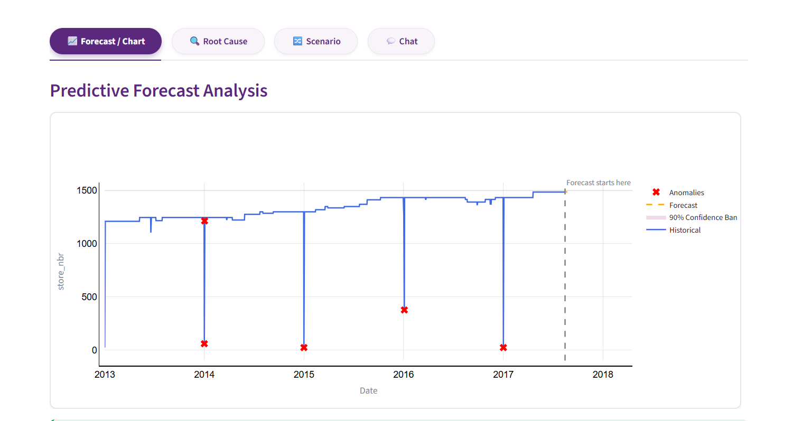
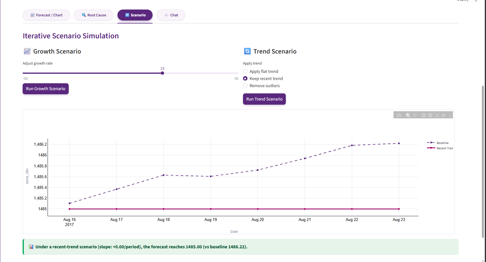
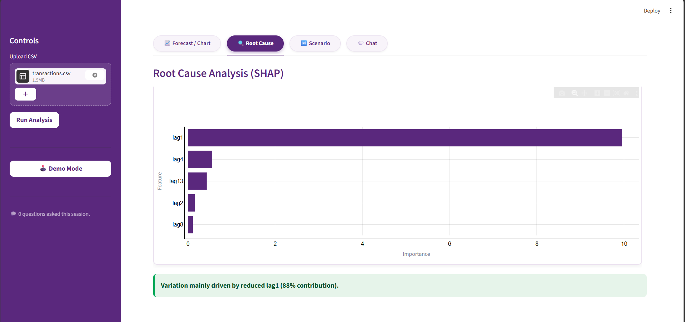
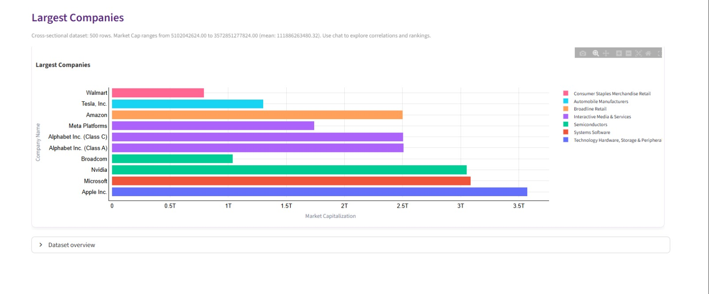
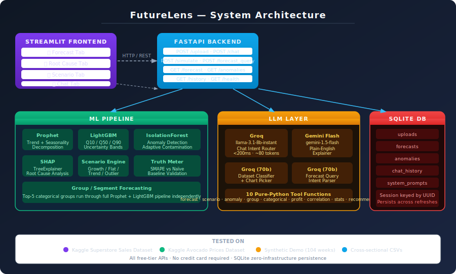
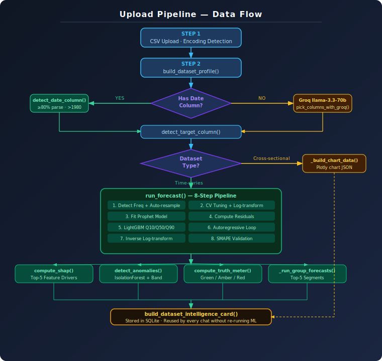
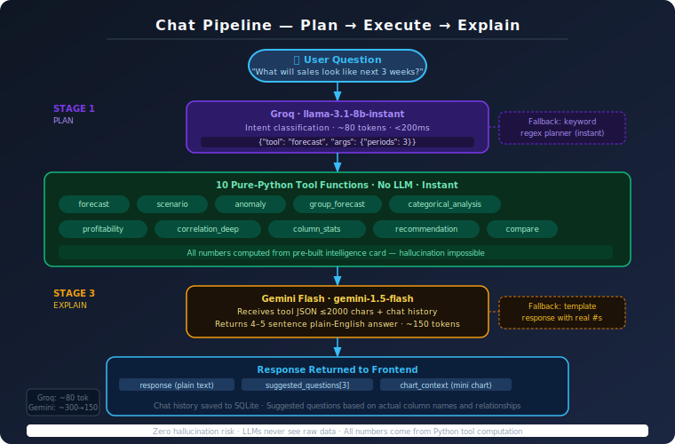

<div align="center">

# 🔮 FutureLens

**AI-powered predictive forecasting — look ahead, not backwards.**

[](https://www.python.org/)
[](https://fastapi.tiangolo.com/)
[](https://streamlit.io/)
[](https://facebook.github.io/prophet/)
[](https://lightgbm.readthedocs.io/)
[](LICENSE)

</div>

---

## Overview

Most teams spend all their time looking backwards — dashboards of last month's numbers, reports on what already happened. FutureLens flips that. Upload any historical CSV and within 30 seconds you get honest forward-looking forecasts with uncertainty bands, automatic anomaly detection, root-cause explanations, and a conversational AI that answers plain-English questions about your data.

The problem it solves: business analysts and operations teams have no accessible forecasting tool that is lightweight, transparent about uncertainty, and explainable to a non-technical audience. FutureLens gives them all three — without writing a single line of code.

Tested extensively on the [Kaggle Superstore Sales dataset](https://www.kaggle.com/datasets/vivek468/superstore-dataset-final) and the [Kaggle Avocado Prices dataset](https://www.kaggle.com/datasets/neuromusic/avocado-prices), as well as synthetic demo data and cross-sectional CSVs. The conversational chat feature in particular has delivered accurate, natural responses across all datasets tested — including correctly handling categorical segments (region, product category) and cross-column correlation questions.

---

## Features

All features listed below are implemented and working.

- **Short-term forecasting with uncertainty bands** — generates 2–8 period forecasts (auto-scaled to dataset size) with three outputs per period: low (Q10), central (Q50), and high (Q90). Never a single overconfident number.
- **Automatic frequency detection** — detects daily, weekly, monthly, quarterly, or yearly data automatically and adapts the forecast horizon accordingly.
- **Adaptive data cleaning** — auto-resamples noisy daily data to weekly sums and applies optional log-transform to stabilise variance in skewed series.
- **Truth Meter** — every forecast is benchmarked against a flat naïve baseline using SMAPE. A colour-coded score (green / amber / red) tells users whether the model adds value or whether more data is needed.
- **Anomaly detection** — flags unexpected spikes and drops using IsolationForest with adaptive contamination. Each anomaly includes date, severity (high / medium / low), direction (spike / drop), deviation %, and whether it falls outside the confidence band.
- **Root cause analysis (SHAP)** — TreeExplainer on the LightGBM model identifies the top-5 feature drivers behind forecast patterns, shown as a bar chart with plain-English explanations.
- **Scenario simulation** — four scenario types (Growth %, Flat trend, Recent trend, Remove outliers) with side-by-side charts and a human-readable summary. Cross-column impact estimates (e.g. "if ad_spend increases by 10%") use Pearson correlation, clearly labelled as statistical estimates.
- **Segment / group forecasting** — auto-detects categorical columns and runs independent forecasts for the top-5 groups, ranked by expected growth %.
- **Cross-sectional dataset support** — when no time axis is found, Groq classifies the dataset type and picks an appropriate Plotly chart automatically. Same pipeline, no manual config.
- **Conversational AI chat** — a two-stage pipeline (Groq routes intent → Python tool computes → Gemini explains in plain English) answers questions about forecasts, anomalies, segments, correlations, and more. Because Gemini only sees pre-computed JSON, it cannot hallucinate numbers.
- **10 chat tools** — forecast, scenario, anomaly, group forecast, categorical ranking, profitability, correlation deep-dive, column stats, recommendation, and group comparison.
- **Suggested follow-up questions** — three dynamic follow-up buttons generated per response, based on the dataset's actual columns and relationships.
- **Inline mini chart in chat** — time-horizon questions ("next 3 weeks") render a forecast chart directly inside the chat panel.
- **Natural-language chart control** — a query bar above the main chart accepts plain-English inputs and updates the chart without opening the chat.
- **Persistent session storage** — all uploads, forecasts, anomalies, chat history, and intelligence cards stored in SQLite keyed by a UUID session ID. State survives browser refreshes.
- **Demo Mode** — one-click demo using a synthetic 104-week dataset with a built-in anomaly at Week 67.
- **Graceful fallbacks** — if Gemini or Groq rate-limit, template-based responses using real numbers from tool output are shown. The app never silently fails.

---

## Screenshots

### Forecast Tab — Uncertainty Bands + Truth Meter


### Conversational AI Chat
The chat is the centrepiece of FutureLens. It handles multi-turn conversations, correctly interprets segment-level questions, gives correlation-based scenario estimates, and explains every number in plain English — with zero hallucination risk.



### Anomaly Detection


### Scenario Simulation — Side-by-Side Comparison


### Root Cause Analysis (SHAP)

### Cross-Sectional Dataset Support

---

## Architecture

### System Architecture



---

### Upload Pipeline — Data Flow



---

### Chat Pipeline — Plan → Execute → Explain



The key design decision in the chat pipeline: Groq classifies intent in ~80 tokens, a Python tool computes the answer instantly from pre-built data, and Gemini only explains the result (~150 tokens). LLMs never touch raw data, so every number in every response comes from the Python computation layer — not from model imagination.

---

## Install and Run

### Prerequisites

- Python 3.10 or higher
- Git
- A free **Gemini API key** — [Get one here](https://aistudio.google.com/app/apikey)
- A free **Groq API key** *(optional)* — [Get one here](https://console.groq.com/)

No credit card required for either API.

---

### Step 1 — Clone the repository

```bash
git clone https://github.com/RudraSuthar09/FutureLens.git
cd FutureLens
```

### Step 2 — Create a virtual environment

```bash
# macOS / Linux
python3 -m venv .venv
source .venv/bin/activate

# Windows
python -m venv .venv
.venv\Scripts\activate
```

### Step 3 — Install dependencies

```bash
pip install -r requirements.txt
```

> **Note:** Prophet depends on `pystan`, which can take a few minutes to compile on first install. This is expected — let it finish.

### Step 4 — Configure environment variables

```bash
cp .env.example .env
```

Open `.env` and fill in your keys:

```env
GEMINI_API_KEY=your_gemini_api_key_here
GROQ_API_KEY=your_groq_api_key_here
DATABASE_URL=futurelens.db
```

Only `GEMINI_API_KEY` is strictly required. Without a Groq key, the planner falls back to keyword routing and all features still work.

### Step 5 — Start the FastAPI backend

Open a terminal:

```bash
uvicorn main:app --host 0.0.0.0 --port 8000
```

Expected output:
```
INFO:     Initializing database...
INFO:     Database initialized successfully.
INFO:     Application startup complete.
INFO:     Uvicorn running on http://0.0.0.0:8000
```

### Step 6 — Start the Streamlit frontend

Open a **second terminal** (same virtual environment):

```bash
streamlit run app.py
```

Your browser opens at **http://localhost:8501**.

---

## Usage

### Option A — Demo Mode (no CSV needed)

Click **🕹️ Demo Mode** in the left sidebar. The app generates a synthetic 104-week dataset with a built-in anomaly at Week 67, runs the full pipeline, and pre-loads a sample chat conversation.

### Option B — Upload your own CSV

1. Click **Upload CSV** in the sidebar and select your file
2. Click **Run Analysis**
3. Wait 10–30 seconds for the pipeline to complete
4. Explore the four tabs: **Forecast**, **Root Cause**, **Scenario**, **Chat**

### CSV format requirements

| Requirement | Detail |
|---|---|
| Date column | Any name; auto-detected. Dates must be after 1980-01-01. |
| Numeric column | At least one numeric column; auto-detected. |
| Minimum rows | 20 rows after cleaning. |
| Encoding | UTF-8, CP1252, or Latin-1 (auto-detected). |
| Max null ratio | Columns with >30% nulls are excluded. |

**Time-series example:**
```csv
date,sales,ad_spend,region,product_category
2022-01-03,12400,1240,North,Electronics
2022-01-10,13100,1310,South,Clothing
```

**Cross-sectional example (no date needed):**
```csv
region,revenue,units_sold,profit_margin
North,145000,2400,0.21
South,98000,1800,0.18
```

---

## Example API Calls

### Upload a CSV

```bash
curl -X POST http://localhost:8000/upload \
  -F "file=@assets/superstore.csv"
```

**Response (truncated):**
```json
{
  "session_id": "a3f7c2d1-...",
  "forecast": [14200.5, 14580.1, 14810.3, 15020.6],
  "lower":    [12800.0, 13100.0, 13300.0, 13500.0],
  "upper":    [15600.0, 16000.0, 16300.0, 16500.0],
  "truth_meter": {
    "reliable": true,
    "color": "green",
    "message": "Model is 24.3% better than baseline (SMAPE: 8.1% vs 10.7%)"
  },
  "anomalies": [
    {
      "date": "2023-06-12",
      "actual": 8540,
      "expected": 11800,
      "severity": "high",
      "deviation_percent": 27.6,
      "direction": "drop"
    }
  ],
  "intelligence_card": {
    "one_liner": "Next 4 weeks: central estimate +6.2% (rising). Lower: -2.1%. Upper: +12.4%."
  }
}
```

### Chat

```bash
curl -X POST http://localhost:8000/chat \
  -H "Content-Type: application/json" \
  -d '{
    "message": "What will sales look like next 3 weeks?",
    "session_id": "a3f7c2d1-..."
  }'
```

**Response:**
```json
{
  "response": "Sales are forecast at 14,200 next week (range 12,800–15,600), reaching 15,020 by Week 3. Overall trend is rising (+6.2%). The top driver is recent lag values. Would you like to test a scenario — e.g. what if sales increases by 10%?",
  "suggested_questions": [
    "Are there any sudden changes I should look at?",
    "If ad_spend increases by 10%, how does that affect sales?",
    "Which region is growing fastest?"
  ],
  "chart_context": {
    "type": "highlight_forecast",
    "periods": 3,
    "label": "Next 3 weeks"
  }
}
```

### Scenario simulation

```bash
curl -X POST http://localhost:8000/simulate \
  -H "Content-Type: application/json" \
  -d '{
    "session_id": "a3f7c2d1-...",
    "change_percent": 10,
    "scenario_type": "growth"
  }'
```

**Response:**
```json
{
  "baseline": [14200.5, 14580.1, 14810.3, 15020.6],
  "scenario": [15620.5, 16038.1, 16291.3, 16522.7],
  "difference_percent": 10.0,
  "summary": "Under a +10% growth scenario, forecast reaches 16,522 by end of period (vs baseline 15,020). Range: 15,620–16,522."
}
```

Interactive Swagger docs: **http://localhost:8000/docs**

---

## Tech Stack

| Category | Technology | Version | Purpose |
|---|---|---|---|
| Language | Python | 3.10+ | All backend and frontend logic |
| Frontend | Streamlit | 1.56.0 | Dashboard UI, 4-tab layout, chat panel, file uploader |
| Visualisation | Plotly | 6.7.0 | Interactive forecast charts, anomaly markers, SHAP bars, scenario comparison |
| Backend API | FastAPI | 0.135.1 | REST API — all endpoints |
| ASGI server | Uvicorn | 0.13.4 | Serves FastAPI |
| Data processing | Pandas | 2.3.3 | DataFrame manipulation, resampling, date parsing |
| Numerics | NumPy | 2.3.4 | Log-transforms, SMAPE, band arithmetic |
| Trend / seasonality | Prophet | 1.3.0 | Decomposes historical trend + yearly/weekly seasonality |
| Quantile regression | LightGBM | 4.6.0 | Q10/Q50/Q90 uncertainty bands on residuals |
| Anomaly detection | scikit-learn | 1.8.0 | IsolationForest |
| Explainability | SHAP | 0.51.0 | TreeExplainer — top feature drivers |
| LLM Explainer | google-generativeai | 0.8.6 | Gemini Flash — plain-English response generation |
| LLM Router | Groq | ≥0.18.0 | LLaMA 3.1-8b — intent classification + tool routing |
| Dataset Classifier | Groq | ≥0.18.0 | LLaMA 3.3-70b — dataset type + chart type detection |
| HTTP client | Requests | 2.32.4 | Streamlit → FastAPI communication |
| File upload | python-multipart | 0.0.5 | Multipart CSV handling |
| Database | SQLite (stdlib) | built-in | Zero-dependency session persistence |
| Config | python-dotenv | 1.2.2 | Loads API keys from `.env` |

### Why these technology choices

**Prophet + LightGBM (quantile) together** — Prophet handles trend and seasonality decomposition on irregular, messy real-world CSVs with minimal configuration. LightGBM quantile regression on the residuals gives honest Q10/Q50/Q90 bands without assuming Gaussian errors — important for retail and financial series where errors are skewed. This combination outperformed either model alone on the Superstore and Avocado test datasets.

**IsolationForest with adaptive contamination** — unsupervised, so no labelled anomaly data is needed. Contamination adapts to data noisiness, meaning clean financial data and noisy retail data are both handled correctly without manual configuration.

**Two-model LLM design (Groq + Gemini)** — Groq is fast (sub-200ms) and free-tier, making it ideal for the intent classification step that only needs ~80 tokens. Gemini only ever sees a compact JSON result from a Python tool (~300 tokens in, ~150 out), which keeps cost near zero and — more importantly — prevents hallucination. LLMs cannot invent numbers when those numbers are computed before the LLM is involved.

**SHAP TreeExplainer** — exact (not approximate) attributions for tree models. Contribution percentages sum to 100% and are explainable to a non-technical audience immediately.

---

## Project Structure

```
FutureLens/
├── main.py                  # FastAPI entrypoint — all REST endpoints + upload pipeline
├── app.py                   # Streamlit frontend — 4-tab dashboard, chat panel, inline charts
├── generate_data.py         # Generates synthetic 104-week CSV for Demo Mode
├── requirements.txt         # Pinned Python dependencies
├── .env.example             # Environment variable template (no real secrets)
│
├── api/
│   ├── forecaster.py        # 8-step forecast pipeline (Prophet + LightGBM quantile)
│   ├── anomaly.py           # IsolationForest anomaly detection + Truth Meter
│   ├── rca.py               # SHAP TreeExplainer — top-5 feature drivers
│   ├── simulator.py         # 4 scenario types
│   ├── planner.py           # Groq intent router + keyword fallback planner
│   ├── tools.py             # 10 pure-Python tool functions (no LLM — all computed)
│   ├── agent.py             # Gemini Flash explainer + template fallback responses
│   ├── column_picker.py     # Groq dataset type + chart type classifier
│   ├── forecast_query.py    # Groq-powered natural-language chart update
│   └── database.py          # SQLite CRUD — uploads, forecasts, anomalies, chat, prompts
│
├── config/
│   └── rules.yaml           # Anomaly-to-action rules (placeholder for future rules engine)
│
├── data/
│   └── sample_data.csv      # Auto-generated demo dataset
│
├── assets/
│   ├── superstore.csv       # Kaggle Superstore Sales — primary test dataset
│   ├── avocado.csv          # Kaggle Avocado Prices — primary test dataset
│   └── screenshots/         # UI screenshots (add before submission)
│
└── docs/
    ├── architecture.svg     # System architecture diagram
    ├── upload_pipeline.svg  # Upload pipeline flowchart
    └── chat_pipeline.svg    # Chat pipeline flowchart
```

---

## API Reference

All endpoints at `http://localhost:8000`. Interactive docs at `/docs`.

| Method | Endpoint | Description |
|---|---|---|
| `POST` | `/upload` | Upload CSV → full pipeline → forecast + anomalies + SHAP + intelligence card |
| `GET` | `/forecast/{session_id}` | Retrieve stored forecast |
| `GET` | `/anomalies/{session_id}` | Retrieve stored anomalies |
| `POST` | `/chat` | Plan → execute tool → Gemini explain → return response |
| `POST` | `/simulate` | Run a scenario on the stored base forecast |
| `POST` | `/forecast_query` | Natural-language chart update |
| `GET` | `/history` | Last 10 uploads |
| `GET` | `/health` | Liveness check |

---

## Limitations

- **Single target column** — one numeric column is forecast per session; multi-variate forecasting is not implemented.
- **SHAP on residual features only** — root cause feature names appear as "lag1", "lag2" etc. rather than original column names, because SHAP runs on the LightGBM residual model.
- **Group forecasts capped at top 5** — groups with fewer than 10 weekly data points are skipped.
- **No authentication** — sessions are UUID-based only. Not suitable for production deployment without auth.
- **SQLite only** — concurrent multi-user deployments would need PostgreSQL.
- **Free-tier rate limits** — Gemini and Groq have per-minute quotas. The app falls back to template responses automatically.
- **No time-zone handling** — dates are parsed as timezone-naive.
- **`config/rules.yaml`** — present in the repo but not actively used by the current pipeline. Placeholder for a future rules-based alert engine.

---

## Troubleshooting

| Problem | Fix |
|---|---|
| `Connection refused` on upload | Ensure FastAPI is running: `uvicorn main:app --host 0.0.0.0 --port 8000` |
| `No valid date column found` | Check your CSV has a date column with values after 1980 |
| `Dataset too small` | Upload a CSV with at least 20 rows |
| Gemini 429 error | Free-tier rate limit hit — app auto-falls back to templates; wait ~60s |
| Groq unavailable | Falls back to keyword routing — all features still work |
| Prophet install fails | Try: `pip install pystan==2.19.1.1 prophet==1.3.0` |
| SHAP install fails on Windows | Try: `pip install shap --no-binary shap` |

---

## Future Improvements

- Map SHAP features back to original column names for immediately readable root cause analysis.
- Add a `tests/` directory with unit tests covering the forecast pipeline, anomaly detector, and all 10 chat tools.
- Add a `/compare_sessions` endpoint to compare forecasts from two datasets side by side.
- Email or Slack alerts when anomalies above a configurable severity threshold are detected.
- Migrate to PostgreSQL for concurrent multi-user deployments.
- User authentication and multi-tenant session management.

---

<div align="center">

AI Predictive Forecasting — *Look ahead, not backwards.*

</div>
